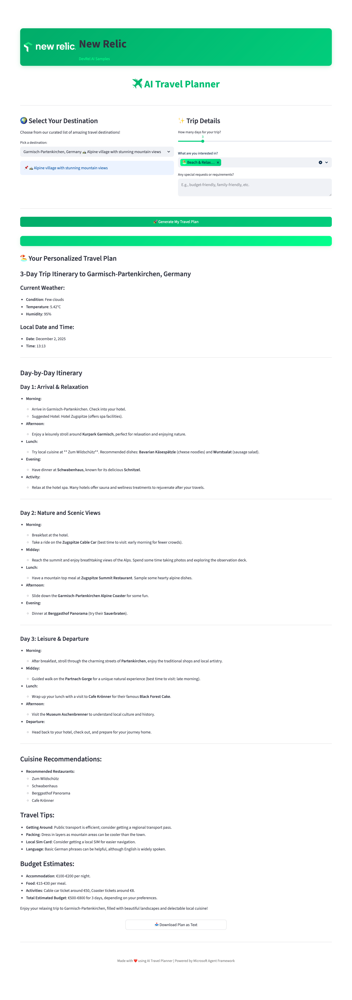

# Examples & Usage

This document provides sample prompts, expected outputs, and tips to get the best results from the AI Travel Planner.



## Quick Usage Examples

### Example 1 — Weekend in Barcelona

- Inputs:
  - Destination: `Barcelona, Spain`
  - Duration: `2` days
  - Interests: `Culture & History`, `Food & Dining`

- Prompt constructed for the agent (internal):

```
Plan a 2-day trip to Barcelona, Spain.

Interests: Culture & History, Food & Dining

Please provide:
1. A detailed day-by-day itinerary with activities
2. Current weather information for the destination
3. Local cuisine recommendations
4. Best times to visit specific attractions
5. Travel tips and budget estimates
6. Current date and time reference
```

- Expected output (abridged):
  - Day 1: La Sagrada Familia visit in the morning (ticket link), Gothic Quarter walking tour, tapas dinner recommendation.
  - Day 2: Park Güell morning visit, beach time or Picasso Museum depending on interest, evening paella recommendation.
  - Weather: `Sunny, 22°C` (example) with brief travel tips.

### Example 2 — Family Trip to Bali (7 days)

- Inputs: `Bali, Indonesia`, `7` days, Interests: `Beach & Relaxation`, `Culture & History`, special requests: `family-friendly, kid activities`
- Expected output: Multi-day schedule with family-friendly beaches, temples, recommended times, child-friendly restaurants, safety tips, and approximate daily budget.

## Prompt Engineering Tips

- Be explicit about constraints: add `budget: low/medium/high`, `family_friendly`, or `accessibility` to the special requests for more tailored results.
- Ask for numbered lists when you want concise action steps.
- If you need more details for a given day, ask a follow-up like: "Expand Day 3 with transit details and ticket costs." The agent will respond in context.

## Edge Cases & Error Handling

- Weather API unavailable: the app returns an explanatory error message. Try again or check `OPENWEATHER_API_KEY`.
- If the model returns generic or off-target suggestions, refine the prompt by specifying the traveler's preferences, pace (relaxed/fast), and budget.

## Sample Conversation Flow

1. User: "Plan a 3-day trip to Tokyo with emphasis on food and temples."
2. Agent: Generates itinerary and calls `get_weather("Tokyo, Japan")` for current weather.
3. User follow-up: "Suggest local ramen spots close to Day 1's itinerary."
4. Agent: Provides short list and adds transit suggestions.

## Output Examples (Reproducible Snippets)

You can copy these example prompts into the UI to test behavior:

- Short weekend:

```
Plan a 2-day trip to Paris, France.
Interests: Culture & History, Food & Dining
Special requests: budget-friendly
```

- Adventure trip:

```
Plan a 5-day adventure trip to Cape Town, South Africa.
Interests: Adventure & Hiking, Culture & History
Special requests: include scenic hikes and a one-day wine tour
```

## Tips for Developers

- If you want deterministic behavior for testing, consider using a lower temperature or a model variant that supports deterministic sampling.
- Add custom tools (e.g., local transit lookup, places API) to enrich recommendations and provide clickable links.

---

If you'd like, I can also add a `SAMPLES/` folder with pre-recorded example outputs (text files) generated by the app to show concrete results.
