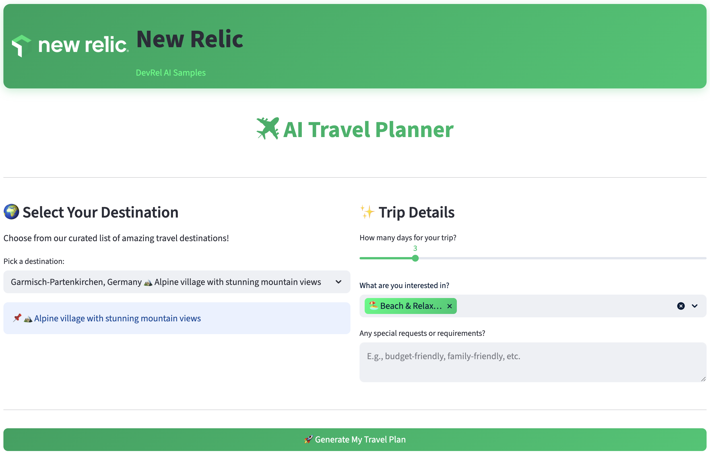

# ✈️ AI Travel Planner - New Relic DevRel Sample

A beautiful, AI-powered travel planning web application built with Streamlit and the Microsoft Agent Framework. This sample demonstrates how to build interactive AI-driven applications with real-time observability using New Relic.



## 🌍 Features

- **Destination Selection**: Choose from 12 curated travel destinations with rich descriptions
- **Customizable Trip Planning**:
  - Adjust trip duration (1-14 days)
  - Select travel interests (Beach, Culture, Food, Adventure, Shopping, Art)
  - Add special requests or requirements
- **AI-Powered Itineraries**: Generate detailed day-by-day travel plans using AI agents
- **Real-time Weather Integration**: Fetch current weather data for destinations
- **New Relic Branding**: Modern UI with New Relic's signature green color palette (#00ce7c, #00FF8C, #00AC69)
- **Full Observability**: Integrated with New Relic telemetry for performance monitoring and tracing
- **Download Plans**: Export generated travel plans as text files

## 🚀 Getting Started

### Prerequisites

- Python 3.8+
- GitHub Models API access (for AI model)
- OpenWeather API key (for weather data)
- New Relic account (optional, for observability)

### Installation

1. Clone or navigate to this repository:

```bash
cd travel-planner-agent
```

2. Create and activate a virtual environment:

```bash
python -m venv venv
source venv/bin/activate  # On Windows: venv\Scripts\activate
```

3. Install dependencies:

```bash
pip install -r requirements.txt
```

### Configuration

Create a `.env` file in the project root with your API keys:

```env
# GitHub Models API
GITHUB_ENDPOINT=https://models.inference.ai.azure.com
GITHUB_TOKEN=your_github_token_here
GITHUB_MODEL_ID=gpt-4o-mini

# Weather API
OPENWEATHER_API_KEY=your_openweather_api_key_here

# New Relic (optional)
OTEL_SERVICE_NAME=travel-planner-web
NEW_RELIC_ENTITY_GUID=your_entity_guid
NEW_RELIC_ACCOUNT=your_account_name
NEW_RELIC_ACCOUNT_ID=your_account_id
NEW_RELIC_TRUSTED_ACCOUNT_ID=your_trusted_account_id
```

### Running the App

Start the Streamlit web application using the provided shell script:

```bash
./run.sh
```

Alternatively, you can run Streamlit directly:

```bash
streamlit run web_app.py
```

The app will open at `http://localhost:8501`

## 📁 Project Structure

```
travel-planner-agent/
├── web_app.py              # Main Streamlit web application
├── app.py                  # Original CLI-based agent script
├── requirements.txt        # Python dependencies
├── .env                    # Environment variables (create this)
├── .env.example            # Example environment file
├── static/
│   └── assets/
│       └── newrelic-logo.png   # New Relic logo (embedded in header)
├── run.sh                  # Shell script to run the app
└── README.md              # This file
```

## 🎯 How It Works

1. **User Input**: Select a destination and customize your trip preferences
2. **AI Agent Processing**: The Microsoft Agent Framework processes your request
3. **Tool Execution**: The agent calls tools to:
   - Confirm the selected destination
   - Fetch current weather data
   - Get current date/time
4. **Plan Generation**: AI generates a detailed, personalized travel itinerary
5. **Display & Download**: View the plan in the web UI or download as text

## 🛠️ Technology Stack

- **Frontend**: Streamlit (Python web framework)
- **AI**: Microsoft Agent Framework + GitHub Models (GPT-4o-mini)
- **APIs**: OpenWeather API, GitHub Models API
- **Observability**: New Relic + OpenTelemetry (OTLP)
- **Styling**: Custom CSS with New Relic brand colors

## 🎨 New Relic Color Scheme

The application uses New Relic's official color palette:

- **Primary Green**: `#00ce7c`
- **Accent Green**: `#00FF8C`
- **Dark Green**: `#00AC69`

All UI components (buttons, sliders, headers, footers) are themed with these colors for a cohesive brand experience.

## 📊 Observability & Telemetry

The app integrates with New Relic for:

- **Distributed Tracing**: Track agent execution spans across the application
- **Custom Metrics**: Monitor trip planning requests and response times
- **Logging**: Structured logs for debugging and monitoring
- **Service Observability**: Real-time performance insights

Telemetry data is exported via OpenTelemetry Protocol (OTLP) to New Relic.

## 🔧 Troubleshooting

### Logo not displaying

- Ensure `static/assets/newrelic-logo.png` exists
- The app embeds the logo as base64, so file path resolution is automatic

### Slider colors not applying

- Streamlit version differences may affect CSS selectors; the app includes fallbacks
- Refresh the page (F5) to apply latest CSS

### Weather data not fetching

- Verify your `OPENWEATHER_API_KEY` is valid
- Check that the city name matches OpenWeather's database
- The app includes error handling for API unavailability

### AI responses slow or failing

- Check GitHub Models API credentials and token validity
- Ensure your GitHub token has appropriate scopes
- Review New Relic logs for detailed error traces

## 📝 Environment Variables Reference

| Variable | Description | Example |
|----------|-------------|---------|
| `GITHUB_ENDPOINT` | GitHub Models API endpoint | `https://models.inference.ai.azure.com` |
| `GITHUB_TOKEN` | GitHub personal access token | `ghp_xxx...` |
| `GITHUB_MODEL_ID` | Model to use | `gpt-4o-mini` |
| `OPENWEATHER_API_KEY` | OpenWeather API key | `abc123...` |
| `OTEL_SERVICE_NAME` | Service name for observability | `travel-planner-web` |
| `NEW_RELIC_ENTITY_GUID` | New Relic entity identifier | `MjU0NjkwNDp...` |

## 🤝 Contributing

This is a DevRel sample project. Feel free to fork, modify, and use as a template for your own AI-powered applications.

## 📄 License

This project is part of the New Relic DevRel AI Samples collection.

## 🔗 Resources

- [Microsoft Agent Framework](https://github.com/microsoft/agent-framework)
- [GitHub Models API](https://docs.github.com/en/github-models)
- [Streamlit Documentation](https://docs.streamlit.io)
- [New Relic Observability](https://newrelic.com)
- [OpenTelemetry](https://opentelemetry.io)
